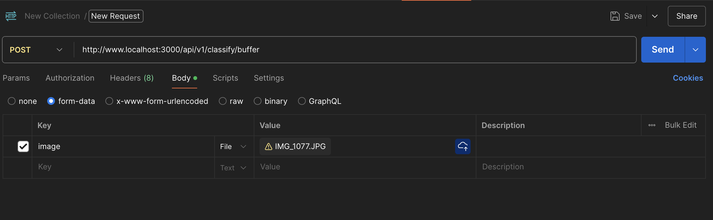

# Image classification / AIMD Buffer - Inference server.

This project explores the use of AIMD (Adaptive Increase / Multiplicative Decrease) as a congestion control mechanism 
for Machine Learning inference task.

### Environment
- Python 3.11.11 (Python 3.9 to 3.11 supports stable Tensorflow distributions)
- Poetry 1.8.4 (Poetry 2.x.x seems to be buggy as of writing this)

We elected to use Tensorflow (version 2) as the ML backend for this project. 

### Run
To get the server up and running.
1. `poetry install` to install dependencies and set up server script program.
2. `poetry run server` to launch the server on `localhost:3000`

In the future there will be tests, hopefully I will get to them soon :).

All APIs are under the path `api/v1`. There are currently two endpoints:
1. [POST] `/classify/single`: Process requests one by one. There are no buffers.
2. [POST] `/classify/buffer`: Process requests by batch. Implements the AIMD buffer queue.

Given an image, the APIs will return a label and a confidence level for the classification. We used the default 
pre-trained Resnet50 model on Imagenet provided by the Tensorflow platform. In the POST request, include image 
(JPG or PNG) in a form-data with key 'image'. An example in Postman is given below.

The server accepts a context file `ctx.yaml` for server configurations and. It also includes a Surface Level Agreement 
(SLA) section to provide performance guarantees for the client.

### Notes
- We elected to use Tensorflow as the ML backend.
- Use Python 3.8 - 3.11 for Tensorflow support. This project uses Python 3.11.11
- For MacOS Silicon users, install `pip install tensorflow tensorflow-metal` for Tensorflow to utilize Apple Silicon GPU.

### TODOs:
- Move buffer to Redis: Buffer is currently implemented directly on-memory.
- Write tests
